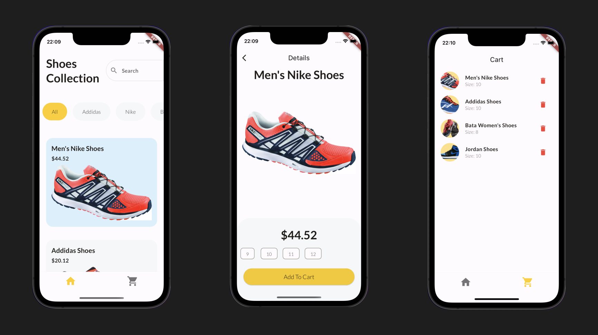
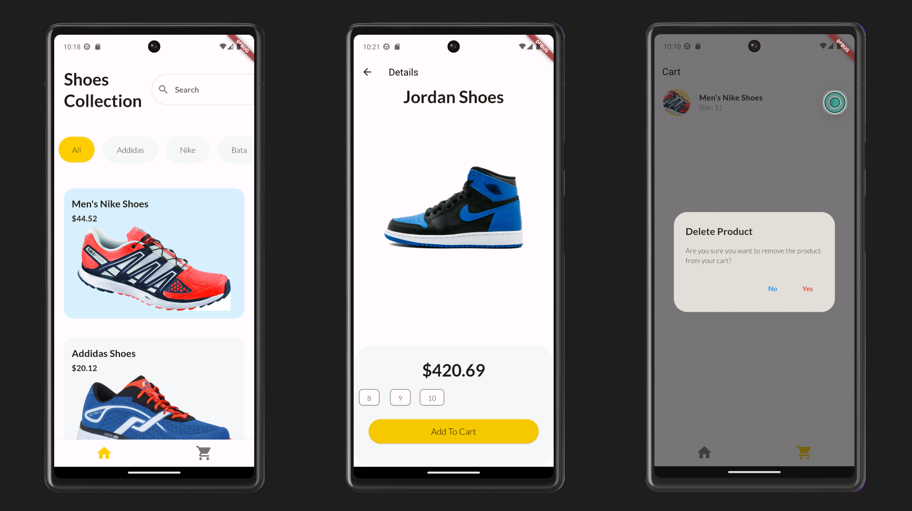

# Flutter Shopping App

## IOS 

## Android

A modern and stylish shopping app built with Flutter, featuring a clean and intuitive user interface. This app allows users to explore a collection of shoes, apply filters for different brands, and seamlessly add products to their cart.

## Key Features
- User-friendly product browsing with filtering options.
- Responsive design for various screen sizes.
- Cart management with the ability to add and remove products.
- Detailed product pages with images, prices, and sizes.
- Smooth navigation with Flutter's routing system.
- Utilizes Provider for efficient state management.

## Technologies Used
- Flutter framework for building cross-platform mobile applications.
- Provider package for efficient state management.
- Dart programming language.

## How to Use
1. Clone the repository.
2. Run `flutter pub get` to install dependencies.
3. Launch the app using `flutter run`.

Feel free to explore, contribute, and customize this Flutter shopping app for your own projects!
